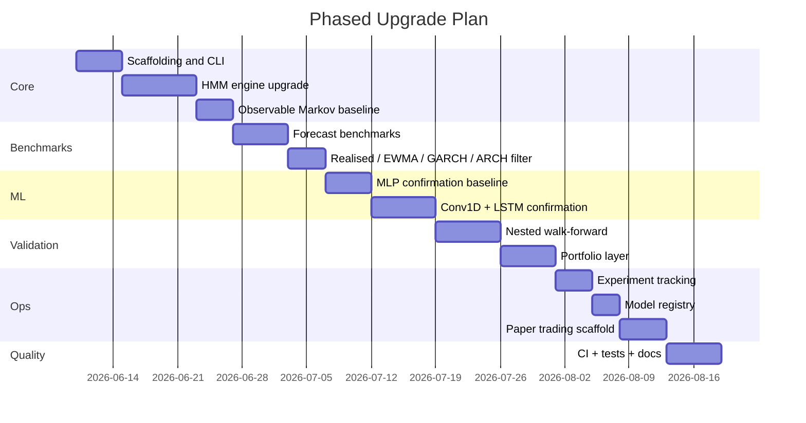

# Implementation Timeline

```mermaid
gantt
    title Phased Upgrade Plan
    dateFormat  YYYY-MM-DD
    section Core
    Scaffolding and CLI          :a1, 2026-06-10, 5d
    HMM engine upgrade           :a2, after a1, 8d
    Observable Markov baseline   :a3, after a2, 4d
    section Benchmarks
    Forecast benchmarks          :b1, after a3, 6d
    Realised / EWMA / GARCH / ARCH filter :b2, after b1, 4d
    section ML
    MLP confirmation baseline    :c1, after b2, 5d
    Conv1D + LSTM confirmation   :c2, after c1, 7d
    section Validation
    Nested walk-forward          :d1, after c2, 7d
    Portfolio layer              :d2, after d1, 6d
    section Ops
    Experiment tracking          :e1, after d2, 4d
    Model registry               :e2, after e1, 3d
    Paper trading scaffold       :e3, after e2, 5d
    section Quality
    CI + tests + docs            :f1, after e3, 6d
```
